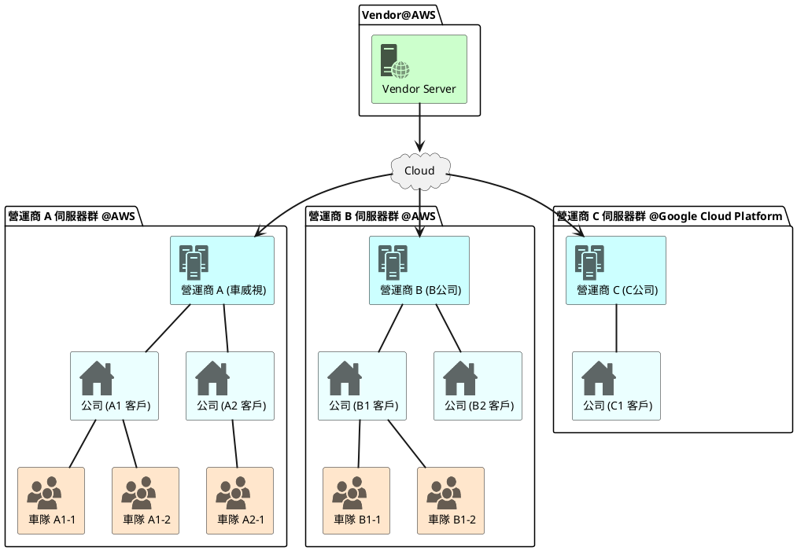

## Server_Client主從式架構

```plantuml
@startuml
!include <tupadr3/common>
!include <office/Servers/web_server_green>
!include <office/Servers/cluster_server_blue>
!include <office/Concepts/home_blue>
!include <office/Users/users_blue>

!include <office/Servers/file_server>
!include <office/Servers/reverse_proxy>
!include <office/Servers/monitoring_sql_reporting_services>
!include <office/Servers/database_server>
!include <office/Servers/call_admission_control_service>
!include <office/Servers/server_generic>
!include <office/Communications/voice_mail_preview_partner>


skinparam actorStyle awesome
'left to right direction

'--- Define ----------------------------------------
!define COLOR_VENDOR #CCFFCC
!define COLOR_OP #cff
!define COLOR_COMPANY #ebffff
!define COLOR_GROUP #ffe6cc
!define COLOR_WEB #e6ffcc

'-------------------------------------------
cloud Cloud


'-------------------------------------------
package "Vendor@AWS" {
    OFF_WEB_SERVER_GREEN(vendorServer, "Vendor Server ", rectangle) COLOR_VENDOR 
}

'-------------------------------------------
package "營運商 A 伺服器群 @AWS" {
    OFF_CLUSTER_SERVER_BLUE(OP1_Server, "營運商 A (車威視)", rectangle) COLOR_OP 
    OFF_HOME_BLUE(Company_A1, "公司 (A1 客戶)", rectangle) COLOR_COMPANY 
    OFF_USERS_BLUE(Group_A1_1, "車隊 A1-1", rectangle) COLOR_GROUP 
    OFF_USERS_BLUE(Group_A1_2, "車隊 A1-2", rectangle) COLOR_GROUP 
    OFF_HOME_BLUE(Company_A2, "公司 (A2 客戶)", rectangle) COLOR_COMPANY 
    OFF_USERS_BLUE(Group_A2_1, "車隊 A2-1", rectangle) COLOR_GROUP 
}

package "營運商 B 伺服器群 @AWS" {
    OFF_CLUSTER_SERVER_BLUE(OP2_Server, "營運商 B (B公司)", rectangle) COLOR_OP 
    OFF_HOME_BLUE(Company_B1, "公司 (B1 客戶)", rectangle) COLOR_COMPANY 
    OFF_USERS_BLUE(Group_B1_1, "車隊 B1-1", rectangle) COLOR_GROUP 
    OFF_USERS_BLUE(Group_B1_2, "車隊 B1-2", rectangle) COLOR_GROUP 
    OFF_HOME_BLUE(Company_B2, "公司 (B2 客戶)", rectangle) COLOR_COMPANY 
}

package "營運商 C 伺服器群 @Google Cloud Platform" {
    OFF_CLUSTER_SERVER_BLUE(OP3_Server, "營運商 C (C公司)", rectangle) COLOR_OP 
    OFF_HOME_BLUE(Company_C1, "公司 (C1 客戶)", rectangle) COLOR_COMPANY 
}

'-------------------------------------------
vendorServer ==> Cloud

Cloud ==> OP1_Server
Cloud ==> OP2_Server
Cloud ==> OP3_Server

OP1_Server == Company_A1
Company_A1 == Group_A1_1
Company_A1 == Group_A1_2
OP1_Server == Company_A2
Company_A2 == Group_A2_1

OP2_Server == Company_B1
Company_B1 == Group_B1_1
Company_B1 == Group_B1_2
OP2_Server == Company_B2

OP3_Server ==Company_C1

'-------------------------------------------

@enduml
```

---
