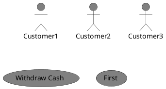

參考: [remark-simple-plantuml](https://github.com/akebifiky/remark-simple-plantuml)

remark-simple-plantuml is a simple plugin for remarkjs that converts PlantUML code blocks to image nodes.

## Installing

```bash
$ npm install --save @akebifiky/remark-simple-plantuml
```

## Integration
You can use this plugin in any frameworks support remarkjs.

If you want to use in the classic preset of Docusaurus 2, like me, set configuration in your `docusaurus.config.js` like following.

```ts
const simplePlantUML = require("@akebifiky/remark-simple-plantuml");

// your configurations...

const config: Config = {
    //....
   presets: [
    [
      'classic',
      {
        docs: {
          sidebarPath: './sidebars.ts',
          remarkPlugins: [simplePlantUML],
          //....
        },
        blog: {
         //....
          remarkPlugins: [simplePlantUML],
        },
        //....
      } satisfies Preset.Options,
    ],
  ],
  //....
}

//...
```
# Your markdown including PlantUML code block

```plantuml Your title
class SimplePlantUMLPlugin {
    + transform(syntaxTree: AST): AST
}
```


